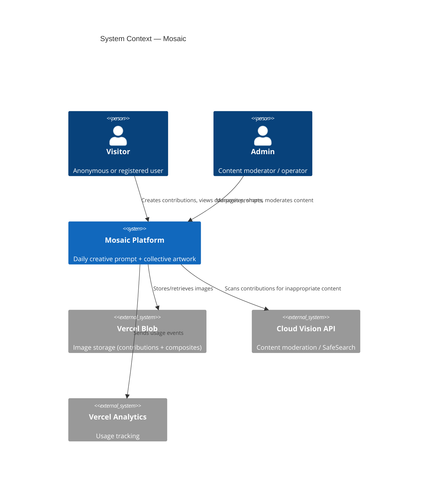
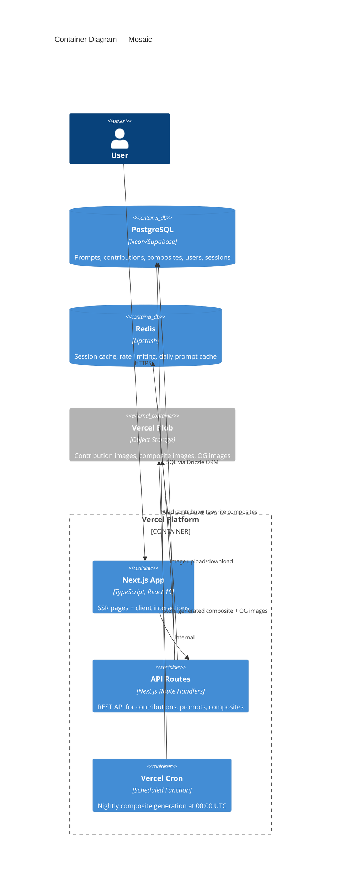

# Phase 2 — System Architecture: Mosaic

## 1. Overview

**Mosaic** is a daily creative prompt platform where users contribute small visual pieces that are composited nightly into a collective artwork. The system is designed for simplicity, reliability, and shareability.

**Tech Stack**: Next.js 15 (App Router) · TypeScript · PostgreSQL · Redis · Vercel · Vercel Blob · Sharp

---

## 2. C4 Context Diagram



## 3. C4 Container Diagram



## 4. Key Components

### 4.1 Next.js App (Frontend)
- **Pages**: `/` (daily prompt + create), `/mosaic/:date` (composite view), `/piece/:id` (individual share), `/about`
- **Client Components**: CreationTool (simple + advanced modes), ShareCard, MosaicViewer
- **Server Components**: PromptDisplay, CompositeGallery (v1.1)
- **State**: React Context for creation flow; no global state manager needed for MVP

### 4.2 API Routes
| Route | Method | Purpose |
|-------|--------|---------|
| `/api/prompts/today` | GET | Current daily prompt |
| `/api/contributions` | POST | Submit contribution (idempotent) |
| `/api/contributions/:id` | GET | Get individual contribution |
| `/api/composites/today` | GET | Today's composite (or latest) |
| `/api/composites/:date` | GET | Historical composite |
| `/api/admin/prompts` | POST | Create future prompts (admin) |
| `/api/admin/moderate` | POST | Approve/reject contributions (admin) |

### 4.3 Nightly Composite Pipeline (Critical Path)

```
┌─────────────────────────────────────────────────────┐
│                 Vercel Cron (00:00 UTC)              │
├─────────────────────────────────────────────────────┤
│ 1. Acquire advisory lock (pg_advisory_lock)         │
│ 2. Fetch today's prompt + all approved contributions│
│ 3. Download contribution images from Blob           │
│ 4. Arrange into grid layout (Sharp composite)       │
│ 5. Generate composite image (PNG + WebP)            │
│ 6. Generate OG image (1200x630)                     │
│ 7. Upload all images to Vercel Blob                 │
│ 8. Insert composite record in DB                    │
│ 9. Invalidate Redis cache for composite             │
│ 10. Release lock                                    │
│ 11. Log success metrics                             │
└─────────────────────────────────────────────────────┘

Failure handling:
- Idempotent: re-running for same date overwrites (upsert)
- Timeout: Vercel Pro allows 300s function timeout
- Alert: On failure, log to Vercel + webhook to Slack/email
- Manual trigger: Admin endpoint to re-run for specific date
```

### 4.4 Caching Strategy (Redis / Upstash)

| Key Pattern | TTL | Purpose |
|-------------|-----|---------|
| `prompt:today` | Until midnight UTC | Current daily prompt |
| `composite:today` | Until next composite gen | Latest composite URL |
| `composite:{date}` | 24h | Historical composite |
| `ratelimit:{ip}` | 60s sliding window | Rate limiting |
| `session:{token}` | 30 days | Anonymous session data |
| `contribution:count:{date}` | Until midnight | Live contribution counter |

---

## 5. Architecture Decision Records

### ADR-001: Next.js 15 on Vercel
- **Decision**: Use Next.js 15 App Router deployed on Vercel
- **Rationale**: SSR for SEO/OG tags, API routes eliminate separate backend, Vercel Cron for scheduled jobs, Vercel Blob for images — single platform, minimal ops
- **Trade-off**: Vendor lock-in to Vercel; acceptable for MVP

### ADR-002: PostgreSQL via Neon Serverless
- **Decision**: Use Neon serverless PostgreSQL with Drizzle ORM
- **Rationale**: Serverless scales to zero, branches for dev/staging, compatible with Vercel edge
- **Trade-off**: Cold start latency (~100ms); mitigated by Redis cache for hot paths

### ADR-003: Sharp for Composite Generation
- **Decision**: Use Sharp (libvips) for server-side image compositing
- **Rationale**: Fast, memory-efficient, supports layered compositing, runs in Node.js
- **Trade-off**: Vercel function size limit; Sharp adds ~20MB — within 50MB limit

### ADR-004: Anonymous-First Session Model
- **Decision**: Issue anonymous session tokens via HttpOnly cookies on first visit
- **Rationale**: Zero-login barrier is a core product requirement; sessions enable idempotent contributions without registration
- **Trade-off**: Session proliferation; mitigate with 30-day expiry + fingerprint dedup

---

## 6. Monitoring & Error Handling

| Concern | Solution |
|---------|----------|
| Composite pipeline failure | Vercel function logs + Slack webhook alert |
| API errors | Structured JSON error responses + Vercel log drain |
| Performance | Vercel Analytics + Web Vitals monitoring |
| Uptime | Vercel status + Upstash Redis health check |
| Image storage | Vercel Blob has built-in redundancy |

**Error Response Format**:
```json
{
  "error": {
    "code": "CONTRIBUTION_DUPLICATE",
    "message": "You have already contributed to today's prompt",
    "status": 409
  }
}
```

---

## 7. Deployment Topology

```
                    ┌─────────────┐
                    │   Vercel     │
                    │   Edge CDN   │
                    └──────┬──────┘
                           │
              ┌────────────┼────────────┐
              │            │            │
        ┌─────┴─────┐ ┌───┴───┐ ┌─────┴─────┐
        │  Next.js   │ │  API  │ │   Cron    │
        │  SSR/SSG   │ │Routes │ │  Function │
        └─────┬─────┘ └───┬───┘ └─────┬─────┘
              │            │            │
         ┌────┴────────────┴────────────┴────┐
         │              Services              │
         ├──────────┬───────────┬─────────────┤
         │ Neon PG  │ Upstash   │ Vercel Blob │
         │ (DB)     │ (Redis)   │ (Images)    │
         └──────────┴───────────┴─────────────┘
```

- **Environments**: Preview (per-PR), Staging (main branch), Production (release tags)
- **Scaling**: Serverless auto-scaling; no capacity planning needed for MVP
- **Regions**: Primary: US East (iad1); Edge: Global CDN
